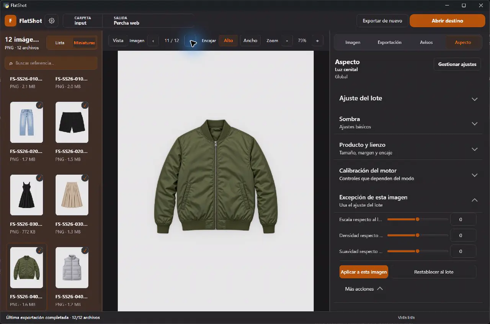
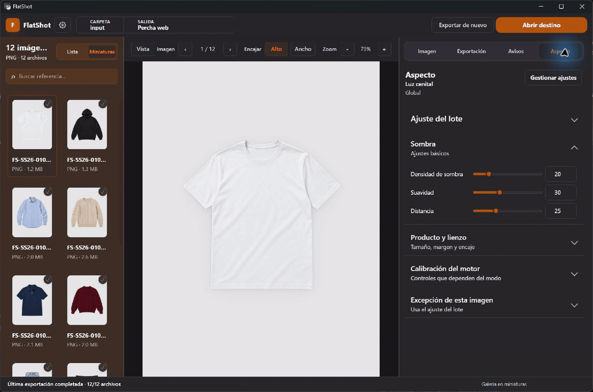
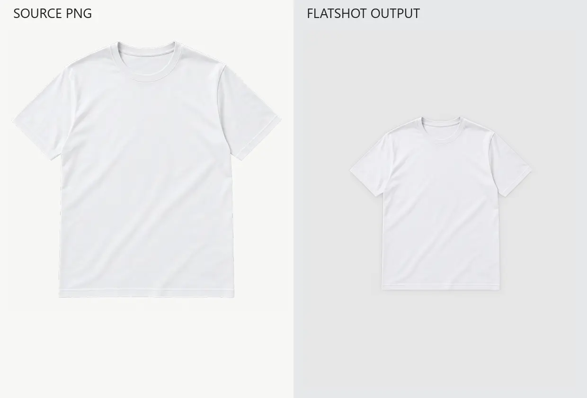
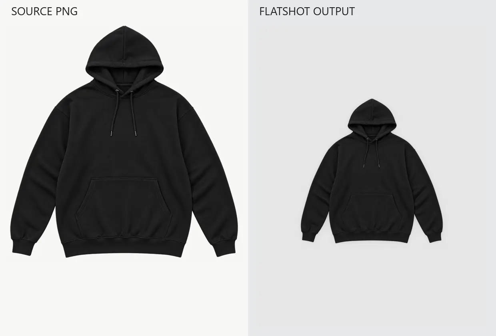
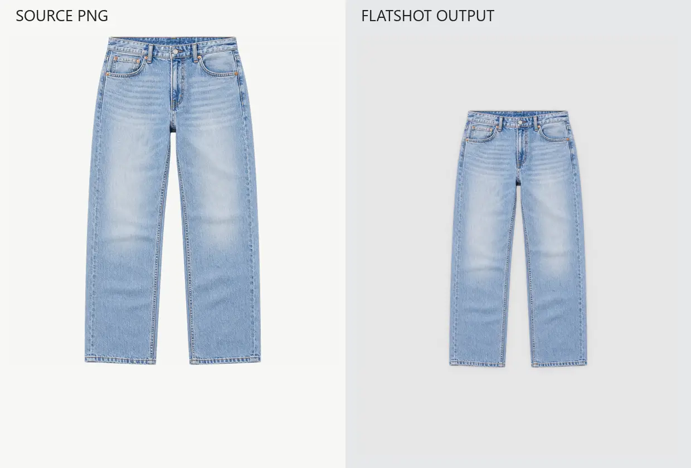
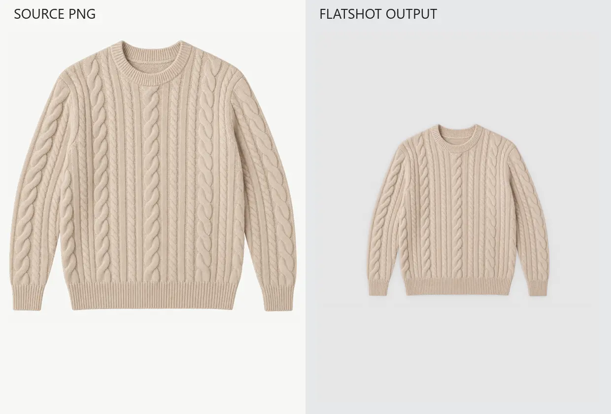
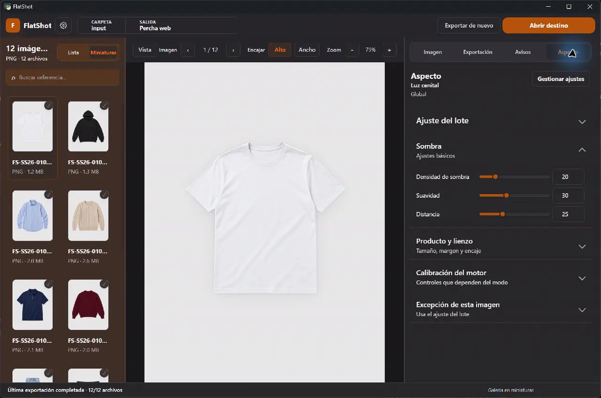
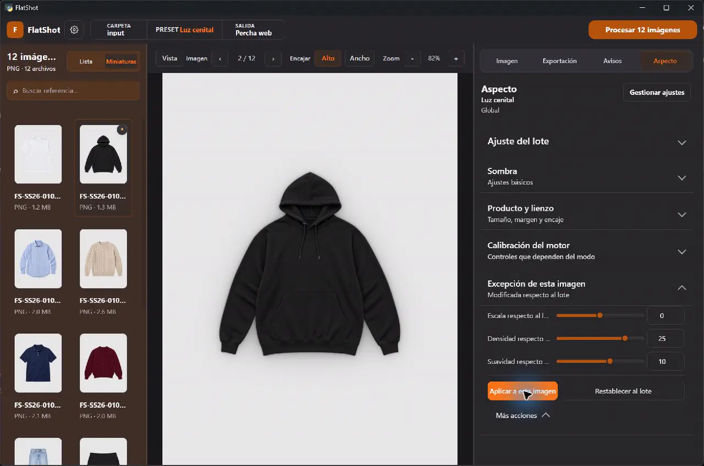
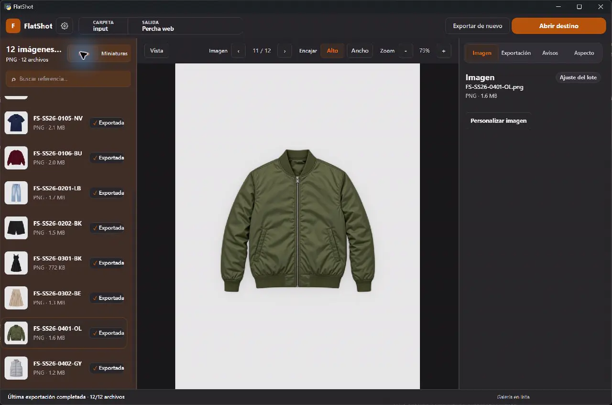

# FlatShot

[](https://github.com/Carlos-Martinez-Martinez/flatshot/releases/latest)
[](https://github.com/Carlos-Martinez-Martinez/flatshot/releases/latest)
[](https://www.python.org/)
[](LICENSE)

Local-first production workbench for turning transparent fashion product images into consistent, e-commerce-ready assets.



## See the workflow

Open a folder, adjust the presentation, review the batch, and export production-ready copies without modifying the source images.



## Source PNG to e-commerce output

Every result below was exported by FlatShot from the sample source PNG shown beside it. No manual retouching was applied after export.

| Light garment | Dark garment |
| --- | --- |
|  |  |

| Denim silhouette | Textured knit |
| --- | --- |
|  |  |

## What it actually does

`Folder -> Adjust -> Preview -> Review -> Export`

- Imports local folders of PNG product images into a reviewable batch.
- Applies reusable presentation presets globally or to an individual image.
- Previews background, placement, and shadow without changing the source file.
- Surfaces invalid files, exclusions, and per-image exceptions before export.
- Configures format, naming, destination, and reusable output profiles explicitly.
- Processes long batches with progress, pause, stop, manifests, and safe non-overwriting output.

## Inside FlatShot

### Production workspace



### Per-image control



### Review and export readiness



## Built for a real production workflow

FlatShot originated inside a fashion e-commerce photography workflow, where large product-image batches need to be reviewed, prepared, and delivered consistently.

The public demo uses synthetic, brand-neutral sample garments so the workflow can be shown without publishing client assets.

## Download for Windows

[Download the latest portable Windows release](https://github.com/Carlos-Martinez-Martinez/flatshot/releases/latest). Extract the ZIP and run `FlatShot.exe` or `Abrir FlatShot.vbs`; no system-wide Python installation is required.

> Status: `v1.0.1` is the current stable Windows release. It replaces the non-relocatable
> `v1.0.0` portable with a fresh-runner-verified PyInstaller bundle. Image
> processing and exported image output are unchanged.

## Quick start

Clone the repository, create a virtual environment, and install the runtime and development dependencies:

```bash
python -m venv venv
```

Windows PowerShell:

```powershell
.\venv\Scripts\Activate.ps1
python -m pip install --upgrade pip
python -m pip install -r requirements.lock -r requirements-dev.txt
python apps/flatshot-desktop/run_dev.py --open
```

macOS or Linux:

```bash
source venv/bin/activate
python -m pip install --upgrade pip
python -m pip install -r requirements.lock -r requirements-dev.txt
python apps/flatshot-desktop/run_dev.py --open
```

The bridge and frontend bind to loopback. The development launcher generates a per-run token and passes it to the page in a URL fragment that is removed after startup.

## Production workflow

1. Import a folder containing PNG images.
2. Choose a preset and adjust the look.
3. Review the selected image and batch exceptions.
4. Configure format, naming, and output destination.
5. Process the batch and inspect the export summary.

Local configuration is stored outside the repository:

- Windows: `%LOCALAPPDATA%\FlatShot`
- macOS: `~/Library/Preferences/FlatShot`
- Linux: `$XDG_CONFIG_HOME/flatshot` or `~/.config/flatshot`

## Architecture

```text
Desktop frontend
  -> localhost HTTP bridge
    -> application services and job runners
      -> image-processing core and models
        -> local configuration, cache, and export filesystem
```

Business and image-processing rules stay outside the UI. Long-running scan, preview, and export work is coordinated by application runners rather than the browser event loop. See [Architecture](docs/ARCHITECTURE.md) and [Product](PRODUCT.md).

## Validation

Run the complete local quality suite:

```bash
python scripts/check_all.py
python scripts/benchmark_shadow_v2.py --smoke --runs 1
python scripts/build_portable.py --skip-venv
```

The checks cover pytest, Ruff, the CSS contract audit, a frontend E2E asset smoke test, visual landmark regression checks, and a small render benchmark. For CSS changes, both commands below must stay clean:

```bash
python scripts/audit_css.py --check
python -m pytest tests/test_frontend_css_contract.py
```

The automated visual smoke test validates frontend structure and assets; it is not a substitute for manually reviewing representative product images and exported pixels.

## Portable Windows builds

The development portable keeps a local venv, copied sources, autosync, and live
reload. It belongs only to the machine where it was created and is not a
redistributable artifact:

```powershell
python scripts/build_portable.py --skip-venv
```

The release portable is a PyInstaller one-folder bundle with its own CPython
runtime and dependencies. Build the exact pre-tag candidate with:

```powershell
python scripts/package_release_candidate.py --version 1.0.1
```

This creates `release/FlatShotPortable-v1.0.1.zip` and
`release/SHA256SUMS.txt`. Extract the ZIP to a new path and verify the actual
frozen executable, not a repository Python launcher:

```powershell
python scripts/verify_portable_candidate.py `
  release/FlatShotPortable-v1.0.1.zip `
  release/SHA256SUMS.txt `
  --extract-to "$env:TEMP\FlatShot candidate á"
```

`FlatShot.exe --smoke` starts and checks both loopback servers, then shuts them
down without opening a window or processing images. `Abrir FlatShot.vbs` runs
`FlatShot.exe`; it never invokes `pythonw.exe`. On a fresh Windows runner, both
release workflows also launch the extracted executable without arguments and
require the frontend, bridge health endpoint, visible native EdgeChromium
window, WebView2 process, a window screenshot artifact, and clean shutdown
evidence. GitHub's hosted runner does not expose WebView2's DirectComposition
surface to classic Win32 capture, so the PNG can have a white client area. The
workflow records that limitation and requires UI Automation to expose the real
`FlatShot Desktop - Web content` control in addition to the process, HTTP,
HWND, WebView2, log, and cleanup gates.

## Safety and compatibility

- FlatShot creates new output files and refuses collisions; source files are not mutated.
- The bridge binds to `127.0.0.1` and portable/development launchers use a per-run authorization token.
- User-selected and configured paths are validated before filesystem operations.
- Configuration changes must remain backward-compatible and tolerate missing or malformed optional values.
- Output-sensitive changes require focused regression tests and a representative manual export check.

Please report vulnerabilities privately as described in [Security](SECURITY.md).

## Contributing

Read [Contributing](CONTRIBUTING.md), the [Code of Conduct](CODE_OF_CONDUCT.md), and [Governance](GOVERNANCE.md) before opening a pull request. Good first contributions include focused tests, documentation improvements, and small maintainability fixes that preserve output.

Project direction is tracked in the [Roadmap](ROADMAP.md), and notable public changes are recorded in the [Changelog](CHANGELOG.md).

## License

FlatShot is released under the [MIT License](LICENSE). Runtime dependencies remain under their respective licenses; see [Third-party notices](THIRD_PARTY_NOTICES.md).
